# InfraMind - Visual Architecture Reference

All Mermaid diagrams in one place for easy reference.

## 1. System Overview

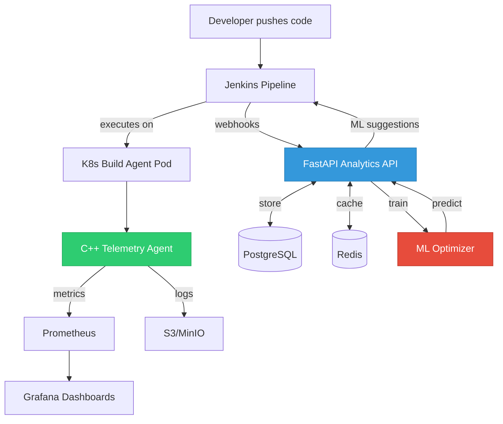

## 2. Optimization Flow

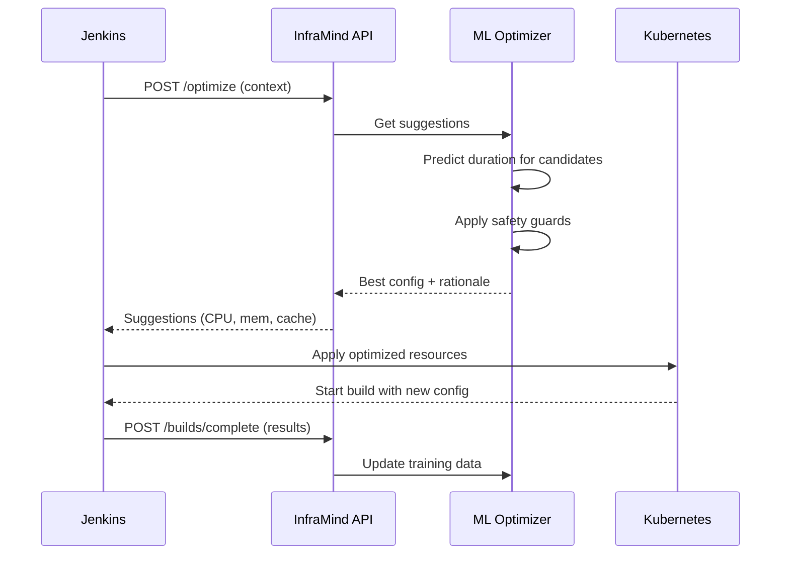

## 3. Data Flow (Complete Build Lifecycle)

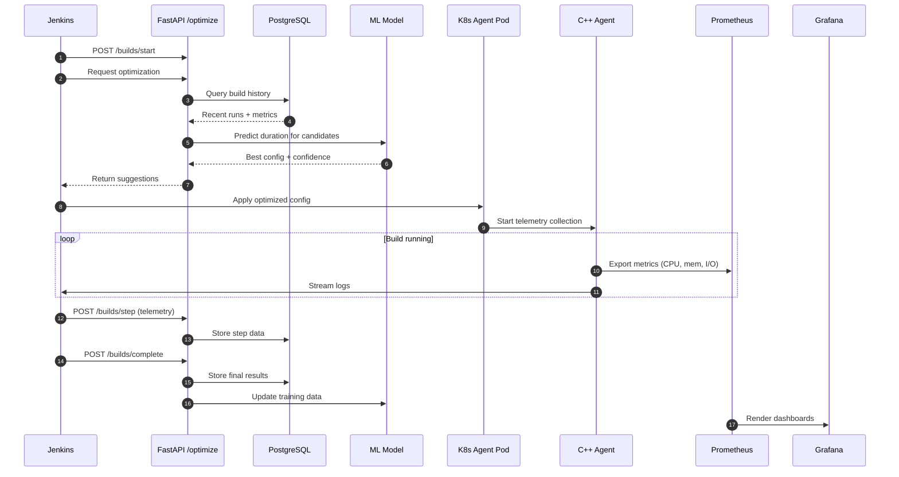

## 4. C++ Agent Architecture

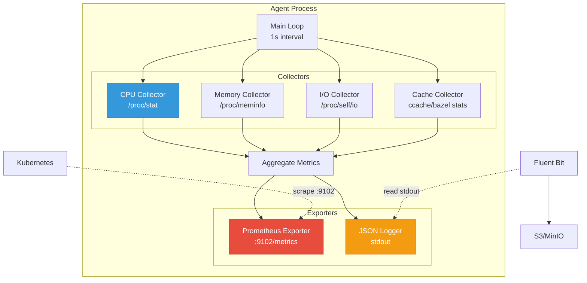

## 5. ML Pipeline Overview

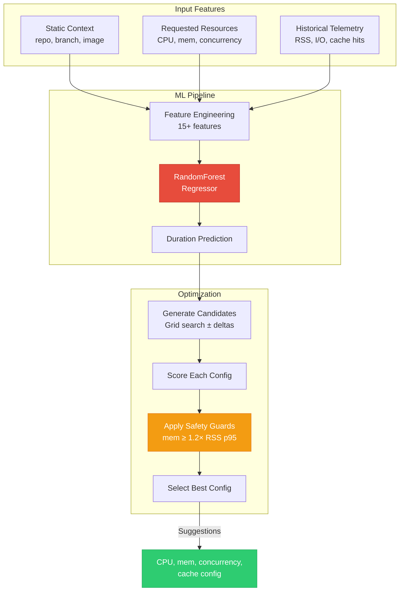

## 6. Training Pipeline

```mermaid
flowchart LR
    subgraph Data Collection
        DB[(PostgreSQL)]
        Fetch[Fetch last 500<br/>successful runs]
        DB --> Fetch
    end

    subgraph Feature Engineering
        Raw[Raw Run Data]
        Compute[Compute Features<br/>CPU, mem, I/O, cache]
        Matrix[Feature Matrix X<br/>Labels y]
        Fetch --> Raw
        Raw --> Compute
        Compute --> Matrix
    end

    subgraph Training
        Split[Train/Test Split<br/>80/20]
        Train[Train RandomForest]
        Eval[Evaluate<br/>MAE, R²]
        Matrix --> Split
        Split --> Train
        Train --> Eval
    end

    subgraph Deployment
        Save[Save Model<br/>joblib]
        Version[Version: v20251025]
        Redis[(Redis<br/>im:model:active)]
        Eval --> Save
        Save --> Version
        Version --> Redis
    end

    style Train fill:#e74c3c,stroke:#c0392b,color:#fff
    style Eval fill:#3498db,stroke:#2980b9,color:#fff
    style Redis fill:#2ecc71,stroke:#27ae60,color:#fff
```

## 7. Optimization Strategy

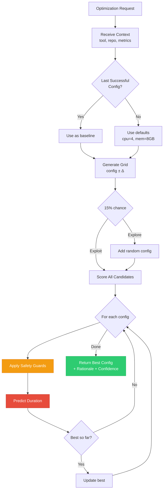

## 8. Kubernetes Deployment

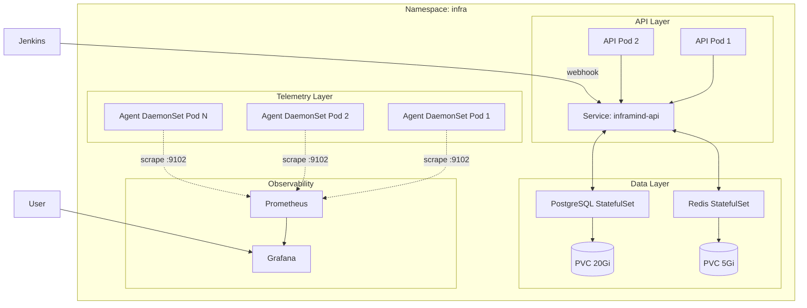

## 9. Docker Compose (Local)

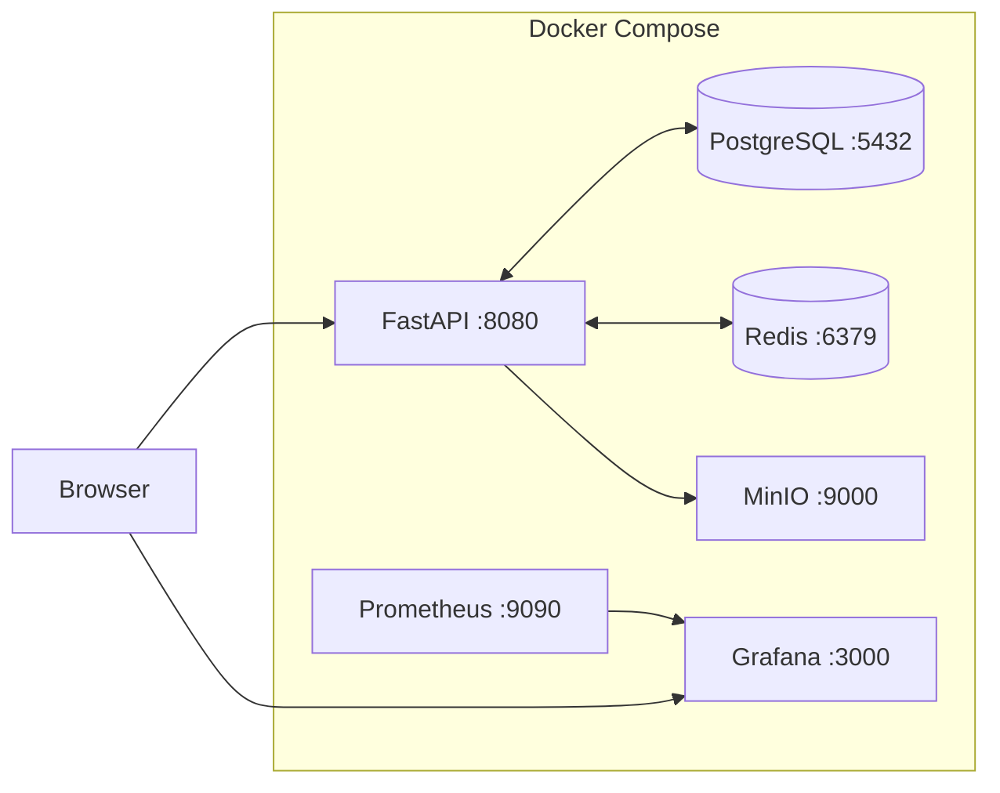

## 10. API Request Flow

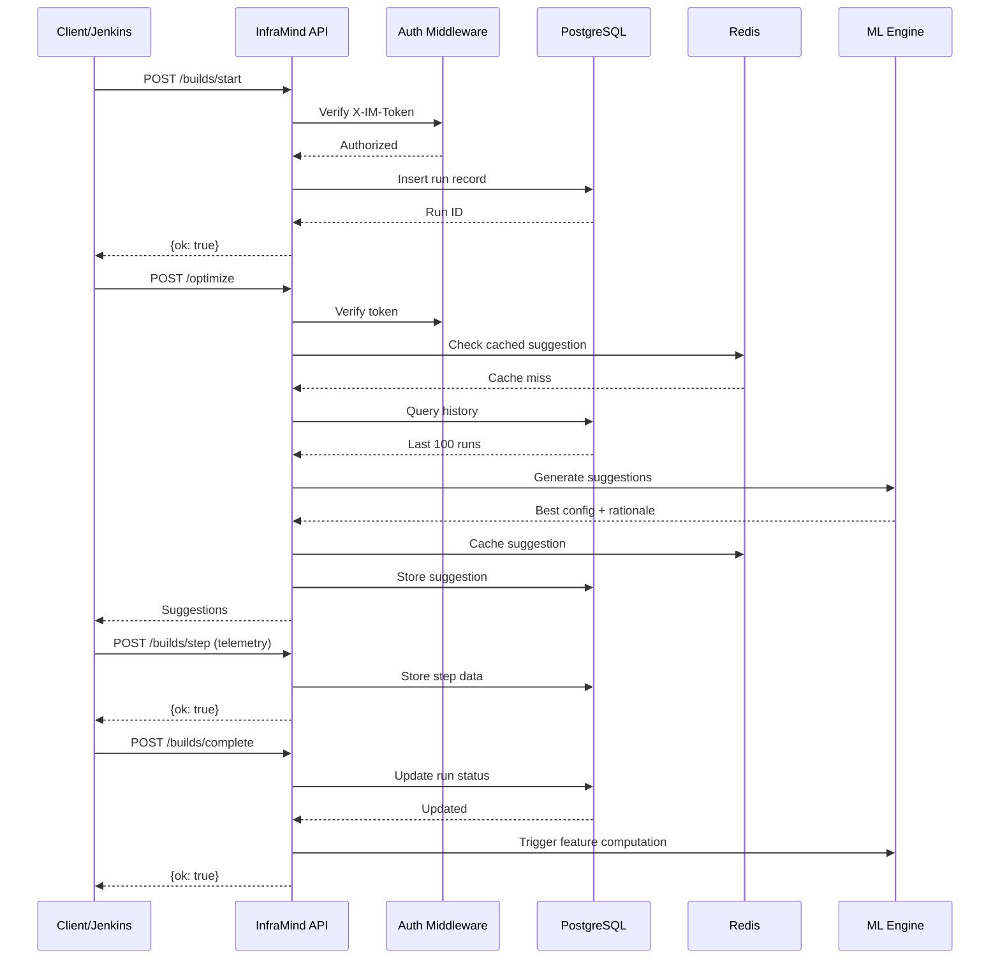

## 11. Demo Data Generation

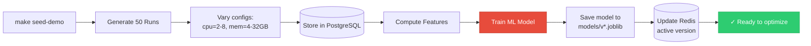

## 12. Build Optimization Impact

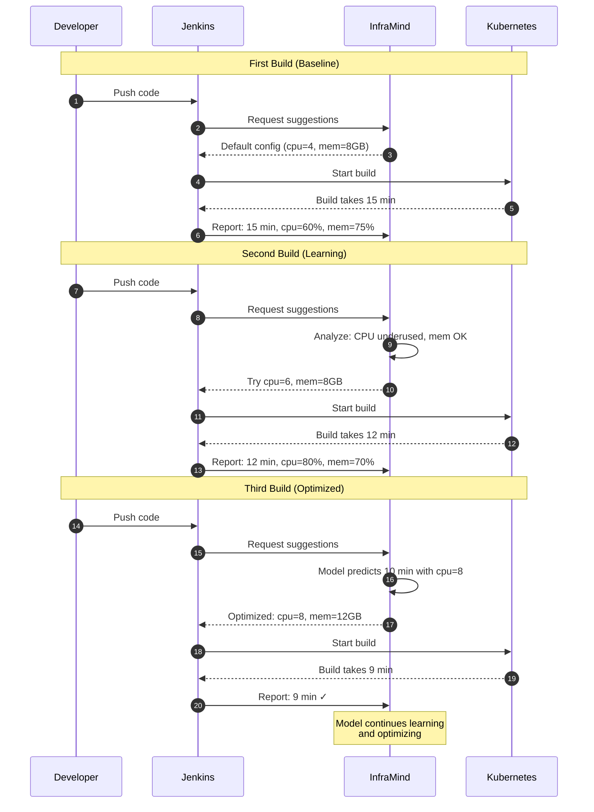

---

**Usage**: These diagrams are rendered in GitHub/GitLab markdown viewers that support Mermaid. For local viewing, use tools like:
- VS Code with Mermaid extension
- Obsidian
- Typora
- Online: https://mermaid.live

---

For more details, see:
- [Architecture Documentation](docs/architecture.md)
- [ML Documentation](docs/ml.md)
- [API Reference](docs/api.md)
- [Benefits & ROI](docs/benefits.md)
