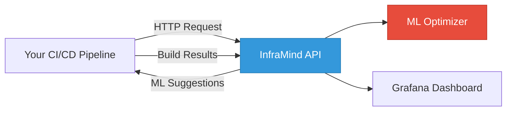

# InfraMind — Intelligent CI/CD Optimization Engine

> **Ship faster, build smarter.** InfraMind uses machine learning to automatically tune your CI/CD builds for optimal performance across any platform.

[](https://opensource.org/licenses/MIT)
[](https://hub.docker.com/r/inframind/inframind)

## What is InfraMind?

InfraMind is an ML-powered optimization engine that learns from your CI/CD build history and automatically suggests optimal configurations for faster, more reliable builds. It works with **any CI/CD platform** - Jenkins, GitHub Actions, GitLab CI, CircleCI, and more.

### Key Features

- **Universal Integration**: Works with any CI/CD platform via simple REST API
- **Intelligent Optimization**: ML-driven suggestions for CPU, memory, and concurrency
- **Deep Telemetry**: Low-overhead profiling of build performance
- **Cache Intelligence**: Automatic tuning of build caches
- **Real-time Dashboards**: Grafana visualizations of build metrics
- **Cost Tracking**: Monitor and optimize build costs
- **5-Minute Setup**: Docker-based deployment with single command

---

## 🚀 Quick Start

### Option 1: One-Command Install (Recommended)

```bash
curl -fsSL https://raw.githubusercontent.com/yourorg/inframind/master/install.sh | bash
```

This will:
- Pull and start all Docker containers
- Set up PostgreSQL, Redis, and Prometheus
- Launch Grafana dashboards
- Start the InfraMind API on `http://localhost:8081`

### Option 2: Manual Docker Compose

```bash
# Clone the repository
git clone https://github.com/yourorg/inframind.git
cd inframind

# Copy environment template
cp .env.example .env

# Start all services
docker-compose up -d

# Verify services are running
docker-compose ps
```

### Access the Services

- **API Documentation**: http://localhost:8081/docs
- **Grafana Dashboards**: http://localhost:3001 (admin/admin)
- **Prometheus**: http://localhost:9092

---

## 💡 How It Works



1. **Before Build**: Your CI/CD calls InfraMind API to get optimized build parameters
2. **During Build**: Telemetry agent collects performance metrics
3. **After Build**: Results are sent back to InfraMind for ML training
4. **Continuous Learning**: Model improves over time with more build data

---

## 🔌 Integration Examples

### Jenkins

```groovy
pipeline {
  stages {
    stage('Optimize') {
      steps {
        script {
          def opts = sh(
            script: "curl -X POST http://inframind:8081/optimize -d '{\"repo\":\"${env.GIT_URL}\",\"branch\":\"${env.BRANCH_NAME}\"}'",
            returnStdout: true
          ).trim()
          env.BUILD_CPUS = sh(script: "echo '${opts}' | jq -r '.cpu'", returnStdout: true).trim()
          env.BUILD_MEMORY = sh(script: "echo '${opts}' | jq -r '.memory'", returnStdout: true).trim()
        }
      }
    }
    stage('Build') {
      steps {
        sh 'make build -j${BUILD_CPUS}'
      }
    }
  }
}
```

### GitHub Actions

```yaml
jobs:
  build:
    runs-on: ubuntu-latest
    steps:
      - uses: actions/checkout@v4

      - name: Get InfraMind Suggestions
        id: optimize
        run: |
          OPTS=$(curl -X POST ${{ secrets.INFRAMIND_URL }}/optimize \
            -H "Content-Type: application/json" \
            -d '{"repo":"${{ github.repository }}","branch":"${{ github.ref }}"}')
          echo "cpu=$(echo $OPTS | jq -r '.cpu')" >> $GITHUB_OUTPUT
          echo "memory=$(echo $OPTS | jq -r '.memory')" >> $GITHUB_OUTPUT

      - name: Build with Optimizations
        run: make build -j${{ steps.optimize.outputs.cpu }}
        env:
          BUILD_MEMORY: ${{ steps.optimize.outputs.memory }}
```

### GitLab CI

```yaml
build:
  stage: build
  before_script:
    - OPTS=$(curl -X POST ${INFRAMIND_URL}/optimize -d "{\"repo\":\"${CI_PROJECT_PATH}\",\"branch\":\"${CI_COMMIT_BRANCH}\"}")
    - export BUILD_CPUS=$(echo $OPTS | jq -r '.cpu')
    - export BUILD_MEMORY=$(echo $OPTS | jq -r '.memory')
  script:
    - make build -j${BUILD_CPUS}
```

### Using the CLI Tool

```bash
# Install CLI tool
pip install inframind-cli

# Get optimization suggestions
inframind optimize --repo myorg/myrepo --branch main

# Report build results
inframind report --duration 180 --status success --cpu 4 --memory 8192
```

See [docs/integration/](docs/integration/) for more examples and detailed guides.

---

## 📊 API Reference

### Get Optimization Suggestions

```bash
POST /optimize
Content-Type: application/json

{
  "repo": "myorg/myrepo",
  "branch": "main",
  "build_type": "release",
  "previous_duration": 300
}
```

**Response:**
```json
{
  "cpu": 8,
  "memory": 16384,
  "concurrency": 8,
  "cache_enabled": true,
  "estimated_duration": 245,
  "confidence": 0.89,
  "rationale": "Increased CPU based on historical patterns for release builds"
}
```

### Report Build Results

```bash
POST /builds/complete
Content-Type: application/json

{
  "repo": "myorg/myrepo",
  "branch": "main",
  "duration": 245,
  "status": "success",
  "cpu": 8,
  "memory": 16384
}
```

Full API documentation: http://localhost:8081/docs

---

## 📚 Documentation

| Document | Description |
|----------|-------------|
| [Getting Started](docs/getting-started.md) | Detailed setup guide |
| [Architecture](docs/architecture.md) | System design & components |
| [API Reference](docs/api.md) | Complete API documentation |
| [ML Models](docs/ml.md) | How the optimizer works |
| [Integration Guides](docs/integration/) | CI/CD platform integration |
| [Deployment](docs/deployment/) | Production deployment guides |

---

## 🏗️ Architecture

InfraMind consists of several components:

- **FastAPI Service**: REST API with ML optimization engine
- **PostgreSQL**: Stores build history and model data
- **Redis**: Caching and rate limiting
- **Prometheus**: Metrics collection
- **Grafana**: Visualization dashboards
- **C++ Telemetry Agent**: Optional low-overhead profiling

All components run in Docker containers and can be deployed via Docker Compose or Kubernetes.

See [docs/architecture.md](docs/architecture.md) for detailed architecture diagrams.

---

## 🛠️ Development

```bash
# Start development environment
docker-compose up -d

# Run API tests
cd services/api
pytest

# Build C++ agent
cd agents/cpp_agent
cmake -S . -B build && cmake --build build

# Generate demo data
cd services/api
python app/scripts/generate_demo_data.py

# View logs
docker-compose logs -f api
```

See [CONTRIBUTING.md](CONTRIBUTING.md) for contribution guidelines.

---

## 🚀 Production Deployment

### Docker Compose (Simple)

```bash
# Production configuration
docker-compose -f docker-compose.yml -f docker-compose.prod.yml up -d
```

### Kubernetes (Scalable)

```bash
# Deploy to Kubernetes cluster
kubectl apply -f k8s/

# Or use Helm (coming soon)
helm install inframind ./charts/inframind
```

See [docs/deployment/](docs/deployment/) for detailed deployment guides.

---

## 📈 Roadmap

- [x] Core API and ML optimizer
- [x] Docker Compose deployment
- [x] Jenkins integration
- [x] C++ telemetry agent
- [x] Grafana dashboards
- [ ] CLI tool (`inframind-cli`)
- [ ] GitHub Actions native integration
- [ ] GitLab CI native integration
- [ ] Web UI for configuration
- [ ] Multi-tenancy support
- [ ] Advanced cache strategies
- [ ] Cost optimization features

---

## 📝 License

MIT License - see [LICENSE](LICENSE) for details.

---

## 🤝 Contributing

Contributions are welcome! Please read [CONTRIBUTING.md](CONTRIBUTING.md) before submitting PRs.

---

## 💬 Support

- **Issues**: [GitHub Issues](https://github.com/yourorg/inframind/issues)
- **Documentation**: See [docs/](docs/)
- **Questions**: Open a discussion on GitHub

---

## 🌟 Why InfraMind?

**Before InfraMind:**
- Manual tuning of build parameters
- Slow builds wasting developer time
- Over-provisioned resources increasing costs
- Trial and error optimization

**After InfraMind:**
- Automatic ML-driven optimization
- 20-40% faster build times
- Right-sized resource allocation
- Data-driven decisions

**Get started in 5 minutes** and see the difference!
