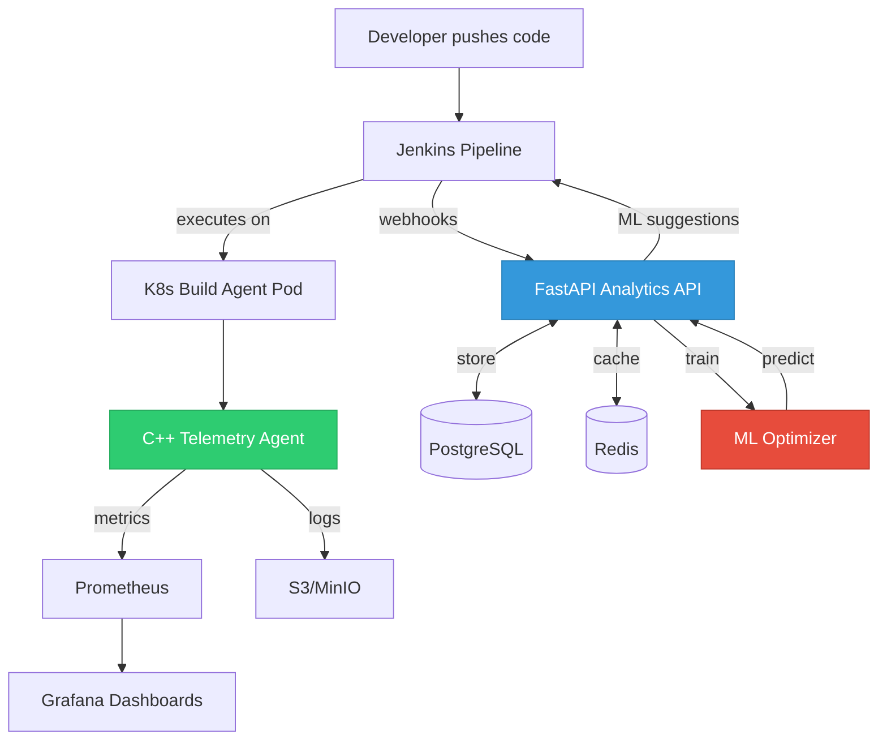
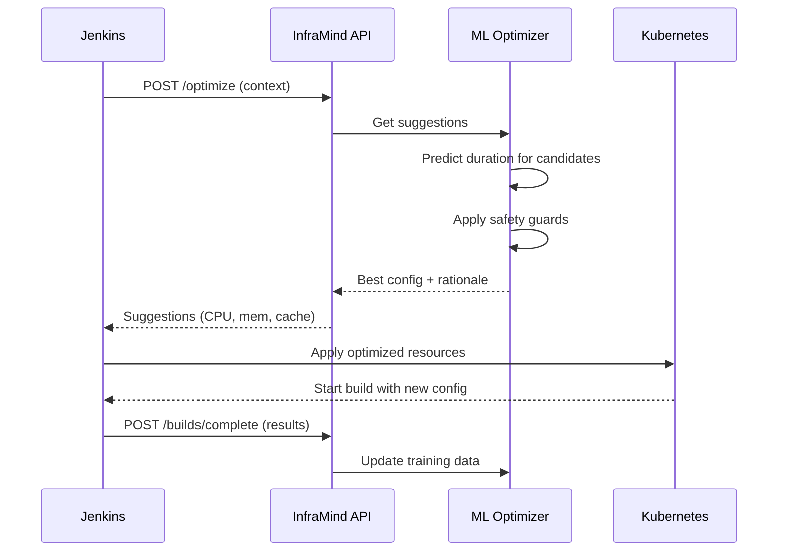

# InfraMind — Intelligent CI/CD Optimization Engine

> **Ship faster, build smarter.** InfraMind observes CI/CD runs, learns what speeds them up, and automatically tunes future runs (agent resources, caching, concurrency).

[](https://opensource.org/licenses/MIT)

## What is InfraMind?

InfraMind is a C++ + Python system that profiles Jenkins and Kubernetes build agents, learns optimal parameters from historical telemetry, and applies those optimizations automatically on the next run. Think: **Datadog + Jenkins + ML** focused on **shorter, more reliable builds**.

### Key Features

- **Intelligent Resource Optimization**: ML-driven suggestions for CPU, memory, and concurrency
- **Deep Telemetry**: C++ agent for low-overhead profiling of builds
- **Cache Intelligence**: Automatic tuning of ccache, bazel cache, and layer caching
- **Jenkins Integration**: Drop-in Shared Library for existing pipelines
- **Real-time Dashboards**: Grafana visualizations of build performance
- **Cost Tracking**: Per-build cost analysis and optimization

## Quick Start

```bash
# Clone and start local demo
git clone https://github.com/yourorg/inframind.git
cd inframind
make up
make seed-demo

# Open dashboards
open http://localhost:8081/docs    # API docs
open http://localhost:3001         # Grafana
```

## Architecture



See [docs/architecture.md](docs/architecture.md) for details.

## Usage

### 1. Add to Jenkins Pipeline

```groovy
@Library('inframind') _

pipeline {
  agent { label 'k8s' }
  environment {
    INFRA_API = 'http://inframind-api.infra.svc.cluster.local:8080'
  }
  stages {
    stage('Optimize') {
      steps { inframindOptimize(params: [tool: 'cmake', repo: 'org/app']) }
    }
    stage('Build') {
      steps {
        inframindStage(name: 'compile') {
          sh 'cmake -S . -B build && cmake --build build -j$(nproc)'
        }
      }
    }
  }
  post {
    always { inframindNotify() }
  }
}
```

### 2. View Optimizations



The optimizer will automatically:
- Tune concurrency based on I/O vs CPU patterns
- Right-size memory to avoid OOMs without over-provisioning
- Enable/configure caching strategies
- Select optimal base images

## Documentation

- [Quick Start Guide](docs/quickstart.md) - Get started in 5 minutes
- [Architecture Overview](docs/architecture.md) - System design & components
- [API Reference](docs/api.md) - REST API endpoints
- [ML Models & Features](docs/ml.md) - How the optimizer works
- [Benefits & ROI](docs/benefits.md) - Performance impact & examples
- [Visual Diagrams](DIAGRAMS.md) - All Mermaid diagrams in one place
- [Project Summary](PROJECT_SUMMARY.md) - Complete project overview

## Development

```bash
# Build C++ agent
make build-agent

# Run tests
make test

# Start dev environment
make up

# Train model
make train
```

See [CONTRIBUTING.md](CONTRIBUTING.md) for development setup.

## Roadmap

- [x] Core API and data model
- [x] Jenkins Shared Library
- [x] C++ telemetry agent
- [x] Basic ML optimizer
- [ ] Advanced cache strategies
- [ ] Multi-cloud cost optimization
- [ ] GitHub Actions integration
- [ ] GitLab CI support

## License

MIT License - see [LICENSE](LICENSE) for details.

## Contributing

Contributions welcome! Please read [CONTRIBUTING.md](CONTRIBUTING.md) and our [Code of Conduct](CODE_OF_CONDUCT.md).

## Support

- Issues: [GitHub Issues](https://github.com/yourorg/inframind/issues)
- Docs: [docs.inframind.dev](https://docs.inframind.dev)
- Chat: [Discord](https://discord.gg/inframind)
