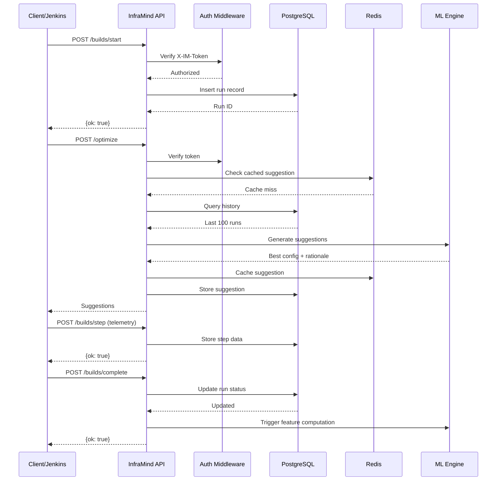

# API Reference

InfraMind FastAPI service endpoints.

## Base URL

- **Local**: `http://localhost:8080`
- **K8s**: `http://inframind-api.infra.svc.cluster.local:8080`

## Authentication

All endpoints (except `/healthz`) require API key:

```bash
curl -H "X-IM-Token: your-api-key" http://localhost:8080/optimize
```

Set in environment: `API_KEY=your-secret-key`

## API Flow



---

## Endpoints

### Health

#### `GET /healthz`

Liveness probe.

**Response**:
```json
{
  "status": "ok",
  "version": "0.1.0",
  "timestamp": "2025-10-25T15:04:05.123Z"
}
```

#### `GET /readyz`

Readiness probe (checks DB + Redis).

**Response**: Same as `/healthz` with `status: "ready"` or error.

---

### Builds

#### `POST /builds/start`

Register a new build.

**Request**:
```json
{
  "pipeline": "org/repo",
  "run_id": "build-123",
  "git": "https://github.com/org/repo",
  "branch": "main",
  "commit": "abc123",
  "image": "builder:v2.0",
  "tools": ["cmake", "ninja"],
  "k8s_node": "ip-10-0-1-42",
  "requested_resources": {
    "cpu": 4,
    "mem_gb": 8,
    "concurrency": 4
  }
}
```

**Response**:
```json
{"ok": true}
```

#### `POST /builds/step`

Record step telemetry.

**Request**:
```json
{
  "run_id": "build-123",
  "stage": "build",
  "step": "compile",
  "span_id": "span-123-build",
  "event": "start|stop",
  "timestamp": "2025-10-25T15:04:05.123Z",
  "counters": {
    "cpu_time_s": 42.5,
    "rss_max_bytes": 2147483648,
    "io_r_bytes": 104857600,
    "io_w_bytes": 26214400,
    "cache_hits": 120,
    "cache_misses": 30
  }
}
```

**Response**:
```json
{"ok": true}
```

#### `POST /builds/complete`

Finalize build.

**Request**:
```json
{
  "run_id": "build-123",
  "status": "success|failure|aborted",
  "duration_s": 420.5,
  "artifacts": [
    {"name": "app.tar.gz", "size": 52428800}
  ],
  "cache": {
    "ccache_enabled": true,
    "size_gb": 10
  }
}
```

**Response**:
```json
{"ok": true}
```

---

### Optimization

#### `POST /optimize`

Get optimization suggestions.

**Request**:
```json
{
  "pipeline": "org/repo",
  "run_id": "build-123",
  "context": {
    "tool": "cmake",
    "repo": "org/repo",
    "image": "builder:v2.0",
    "max_rss_gb": 6.2,
    "io_read_gb": 2.5,
    "cache_hit_ratio": 0.75,
    "num_steps": 5,
    "avg_step_duration_s": 60,
    "duration_s": 300
  },
  "constraints": {
    "max_concurrency": 8,
    "min_ram_gb": 4
  }
}
```

**Response**:
```json
{
  "suggestions": {
    "concurrency": 6,
    "cpu_req": 6,
    "mem_req_gb": 8,
    "cache": {
      "ccache": true,
      "size_gb": 10
    }
  },
  "rationale": "Selected config with predicted duration=420.5s (current baseline: 300s). Evaluated 27 candidates. Safety: mem >= 7.4GB * 1.2.",
  "confidence": 0.7
}
```

---

### Features

#### `GET /features/{run_id}`

Get computed features for a run.

**Response**:
```json
{
  "run_id": "build-123",
  "vector": {
    "cpu_req": 4,
    "mem_req_gb": 8,
    "concurrency": 4,
    "max_rss_gb": 6.2,
    "io_read_gb": 2.5,
    "cache_hit_ratio": 0.75,
    "num_steps": 5,
    "avg_step_duration_s": 60
  },
  "label": {
    "duration_s": 300
  },
  "created_at": "2025-10-25T15:10:00.000Z"
}
```

---

## Error Responses

**401 Unauthorized**:
```json
{
  "detail": "Invalid API key"
}
```

**404 Not Found**:
```json
{
  "detail": "Run not found"
}
```

**500 Internal Server Error**:
```json
{
  "detail": "Internal server error",
  "error": "..."
}
```

---

## Rate Limits

- `/optimize`: 100 req/min per API key
- Other endpoints: 1000 req/min

---

## OpenAPI

Interactive docs: `http://localhost:8080/docs`

Swagger JSON: `http://localhost:8080/openapi.json`
