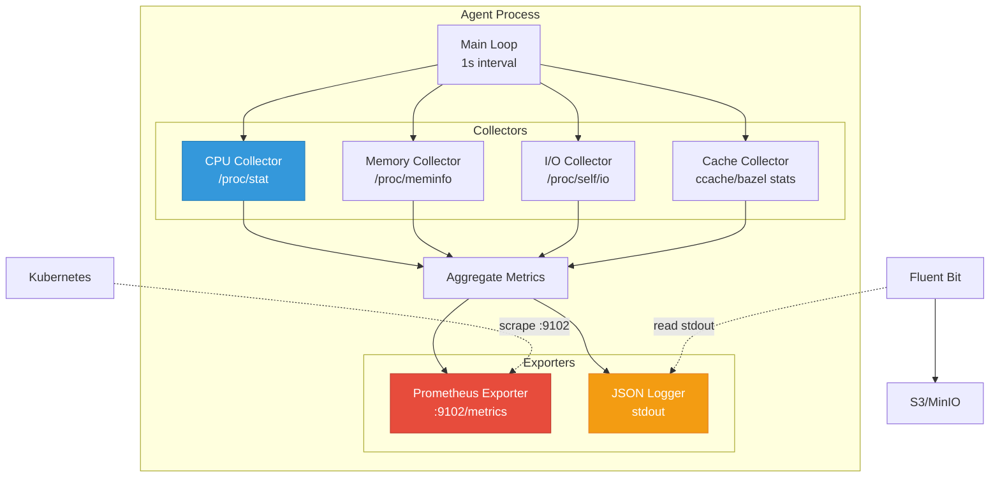
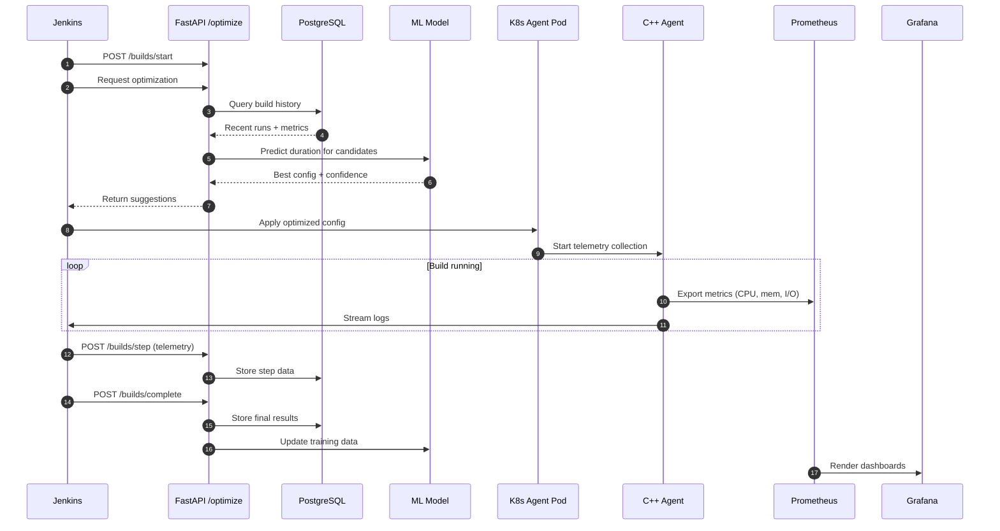
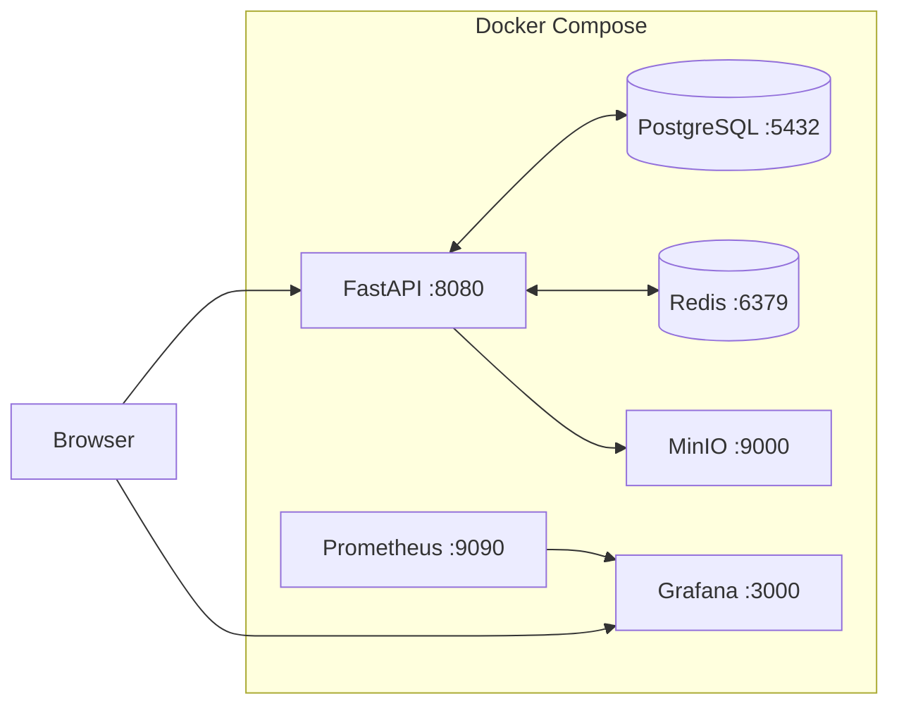
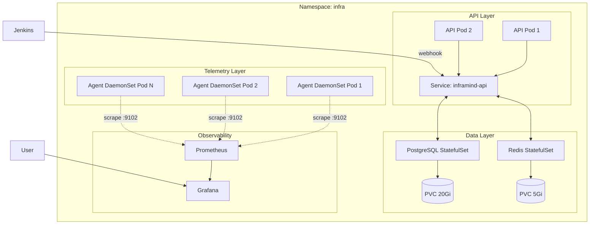

# Architecture Overview

InfraMind is a distributed system for CI/CD optimization with ML-driven resource tuning.

## System Components

### 1. FastAPI Service (`services/api`)

**Purpose**: Central brain of InfraMind. Receives telemetry, trains models, serves optimization suggestions.

**Tech Stack**:
- FastAPI + Pydantic for API
- SQLAlchemy + PostgreSQL for persistence
- Redis for caching
- scikit-learn + LightGBM for ML

**Key Endpoints**:
- `POST /builds/start` - Register new build
- `POST /builds/step` - Record step telemetry
- `POST /builds/complete` - Finalize build
- `POST /optimize` - Get optimization suggestions
- `GET /features/{run_id}` - Inspect features

### 2. C++ Telemetry Agent (`agents/cpp_agent`)

**Purpose**: Low-overhead profiling of build agents. Collects CPU, memory, I/O, and cache metrics.



**Architecture**:
- **Collectors**: Modular metric collectors (CPU, mem, I/O, cache)
- **Exporters**: Prometheus HTTP endpoint (`:9102/metrics`) + JSON logging
- **Runtime**: Runs as DaemonSet or sidecar in Kubernetes

**Metrics Exposed**:
```
im_cpu_usage_percent
im_mem_used_bytes
im_io_read_bytes_total
im_io_write_bytes_total
im_cache_hit_ratio
```

### 3. Jenkins Shared Library (`services/jenkins-shared-lib`)

**Purpose**: Drop-in integration for existing Jenkins pipelines.

**Functions**:
- `inframindOptimize()` - Fetch suggestions and set env vars
- `inframindStage()` - Wrap stages with telemetry
- `inframindNotify()` - Report completion

**Usage**:
```groovy
@Library('inframind') _
pipeline {
  stages {
    stage('Optimize') {
      steps { inframindOptimize(params: [tool: 'cmake']) }
    }
    stage('Build') {
      steps { inframindStage(name: 'compile') { sh 'make' } }
    }
  }
  post { always { inframindNotify() } }
}
```

### 4. ML Optimizer (`services/api/app/ml`)

**Components**:
- **Feature Engineering**: Compute features from run + step data
- **Model Training**: RandomForest regressor predicting `duration_s`
- **Optimizer**: Grid search + safety guards to select config
- **Model Store**: Versioned model persistence with joblib

**Safety Guards**:
- Memory ≥ 1.2× historical RSS p95
- CPU ≥ concurrency / 4
- Bounded exploration (±25% from last success)

**Optimization Loop**:
1. Receive context (repo, tool, recent metrics)
2. Generate candidate configs (grid around last success)
3. Score each with trained model
4. Apply safety constraints
5. Return argmin with rationale

## Data Flow



## Deployment Modes

### Local (Docker Compose)

```bash
make up
```



All services on localhost with persistent volumes.

### Kubernetes

```bash
kubectl apply -f deploy/k8s/namespace.yaml
kubectl apply -f deploy/k8s/
```



Components:
- API: Deployment (2 replicas)
- Agent: DaemonSet (all nodes)
- Postgres: StatefulSet
- Redis: StatefulSet
- Prometheus: Operator
- Grafana: Deployment

### Helm

```bash
helm install inframind deploy/helm/inframind \
  --namespace infra --create-namespace \
  --set api.image.tag=v0.1.0 \
  --set agent.image.tag=v0.1.0
```

## Security

- **API Authentication**: API key via `X-IM-Token` header
- **RBAC**: ServiceAccount with minimal permissions (read/patch pods)
- **Secrets**: Kubernetes Secrets for DB credentials
- **Network Policies**: Restrict egress to DB/Redis only
- **TLS**: Optional mTLS for API (via Istio/Linkerd)

## Scaling

### Horizontal
- API: Scale to N replicas (stateless)
- Agent: DaemonSet (automatic per node)

### Vertical
- Postgres: Increase storage for long retention
- Redis: Increase memory for more cache

### Performance
- API: p99 < 200ms for `/optimize`
- Agent: < 1% CPU overhead
- Model inference: < 10ms
