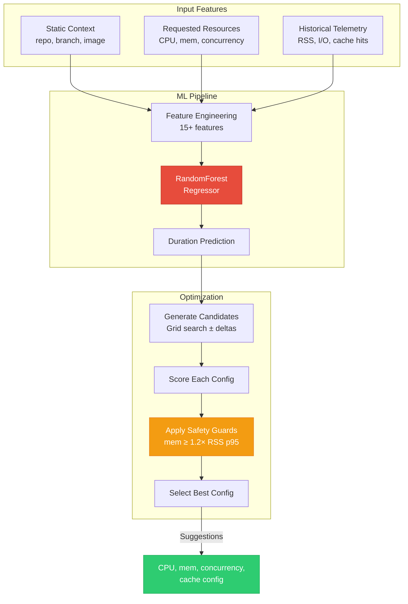
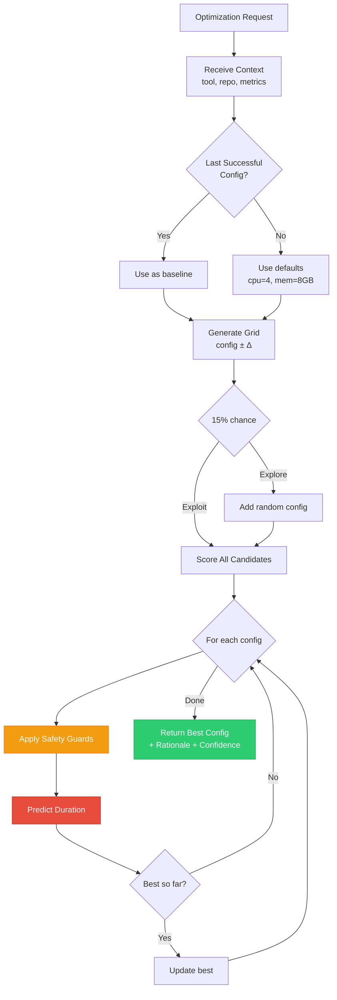

# Machine Learning Models

How InfraMind learns to optimize your builds.

## Overview

InfraMind uses **supervised learning** to predict build duration based on:
- **Static context**: repo, branch, toolchain
- **Requested resources**: CPU, memory, concurrency
- **Historical telemetry**: previous runs' metrics

**Goal**: Minimize `duration_s` while avoiding OOM and resource starvation.



## Features

### Input Features (per run)

**Static**:
- `image`: Base image tag (encoded)
- `branch`: main vs PR (encoded)
- `node`: K8s node type (encoded)

**Resources**:
- `cpu_req`: Requested vCPU
- `mem_req_gb`: Requested memory
- `concurrency`: Make/Ninja parallelism

**Telemetry**:
- `max_rss_gb`: Peak memory usage
- `io_read_gb`, `io_write_gb`: Disk I/O
- `cache_hit_ratio`: ccache/bazel hits
- `num_steps`: Pipeline complexity
- `avg_step_duration_s`: Per-step time

### Labels

- **Primary**: `duration_s` (total build time)
- **Secondary**: `success` (0/1), `retry_count`

## Model

### Algorithm

**RandomForestRegressor** (default):
- `n_estimators=100`
- `max_depth=15`
- Handles non-linear relationships
- Robust to outliers

**Future**: LightGBM for faster training on large datasets.

### Training Pipeline

```mermaid
flowchart LR
    subgraph Data Collection
        DB[(PostgreSQL)]
        Fetch[Fetch last 500<br/>successful runs]
        DB --> Fetch
    end

    subgraph Feature Engineering
        Raw[Raw Run Data]
        Compute[Compute Features<br/>CPU, mem, I/O, cache]
        Matrix[Feature Matrix X<br/>Labels y]
        Fetch --> Raw
        Raw --> Compute
        Compute --> Matrix
    end

    subgraph Training
        Split[Train/Test Split<br/>80/20]
        Train[Train RandomForest]
        Eval[Evaluate<br/>MAE, R²]
        Matrix --> Split
        Split --> Train
        Train --> Eval
    end

    subgraph Deployment
        Save[Save Model<br/>joblib]
        Version[Version: v20251025]
        Redis[(Redis<br/>im:model:active)]
        Eval --> Save
        Save --> Version
        Version --> Redis
    end

    style Train fill:#e74c3c,stroke:#c0392b,color:#fff
    style Eval fill:#3498db,stroke:#2980b9,color:#fff
    style Redis fill:#2ecc71,stroke:#27ae60,color:#fff
```



Triggered:
1. **Nightly**: Cron job via `make train`
2. **Manual**: `docker-compose exec api python -m app.ml.trainer`
3. **API**: `POST /train` (admin-only)

**Process**:
```python
# Fetch last 500 successful runs
runs = get_recent_runs(pipeline, limit=500)

# Build feature matrix
X, y = build_feature_matrix(runs)

# Train/test split (80/20)
X_train, X_test, y_train, y_test = train_test_split(X, y, test_size=0.2)

# Train model
model = RandomForestRegressor(...)
model.fit(X_train, y_train)

# Evaluate
mae = mean_absolute_error(y_test, y_pred)
r2 = r2_score(y_test, y_pred)

# Save
save_model(model, version, metrics)
```

### Evaluation Metrics

- **MAE** (Mean Absolute Error): Average prediction error in seconds
- **R²** (Coefficient of Determination): How well model explains variance
- **Goal**: MAE < 30s, R² > 0.7

## Optimization Strategy



### Candidate Generation

For each optimization request:
1. Start from last successful config
2. Generate grid: `config ± {-2, -1, 0, 1, 2}` for each dimension
3. Add random exploration (15% chance)

### Scoring

```python
for config in candidates:
    # Apply safety guards
    safe_config = apply_safety_guards(config, context)

    # Predict duration
    pred = model.predict(features(context, safe_config))

    # Track best
    if pred < best_pred:
        best = safe_config
```

### Safety Guards

**Memory**:
```python
min_mem_gb = max(2, rss_p95_bytes * 1.2 / (1024^3))
config['mem_req_gb'] = max(config['mem_req_gb'], min_mem_gb)
```

**CPU**:
```python
min_cpu = max(1, config['concurrency'] / 4)
config['cpu_req'] = max(config['cpu_req'], min_cpu)
```

**Concurrency**:
- Capped at 16 (diminishing returns)
- Avoid > 2× historical unless confidence > 0.8

## Exploration vs Exploitation

**Bandit Strategy**:
- 85% **Exploit**: Use model's argmin
- 15% **Explore**: Random config within bounds

**Future**: Thompson Sampling for per-pipeline bandits.

## Model Versioning

Models stored as:
```
models/
  model_v20251025_143022.joblib
  model_v20251025_143022.json  # metrics
```

Active version in Redis: `im:model:active`.

## Retraining

**Triggers**:
- Every 1000 new runs
- MAE drift > 20% from baseline
- Manual request

**Strategy**:
- Incremental: Add new data to training set
- Full retrain every 10k runs

## Feature Importance

```python
import joblib
model = joblib.load('models/model_v1.joblib')
importances = model.feature_importances_

# Top 3:
# 1. max_rss_gb (0.35)
# 2. io_read_gb (0.22)
# 3. num_steps (0.18)
```

## Future Enhancements

1. **LightGBM**: Faster training for large datasets
2. **Bayesian Optimization**: More efficient search
3. **Multi-objective**: Optimize duration + cost
4. **Per-stage Models**: Optimize individual stages
5. **Contextual Bandits**: Adaptive exploration
