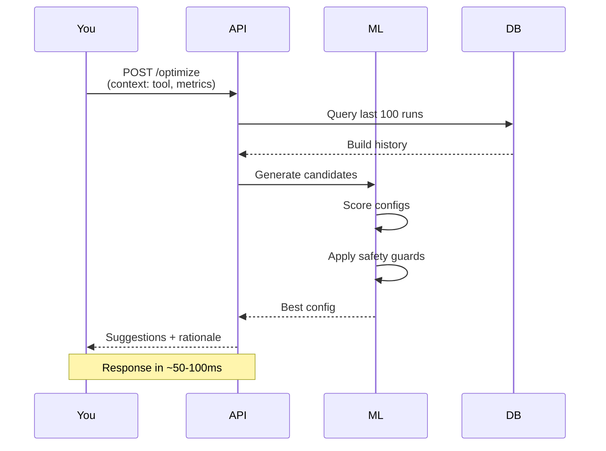

# Quick Start Guide

Get InfraMind running locally in under 5 minutes!

## Prerequisites

- Docker & Docker Compose
- 8GB RAM minimum
- macOS, Linux, or WSL2

## Local Demo

### 1. Clone and Start

```bash
git clone https://github.com/yourorg/inframind.git
cd inframind

# Start all services
make up

# Wait ~30 seconds for services to initialize
docker-compose ps
```

### 2. Seed Demo Data

```bash
# Generate 50 synthetic build runs and train initial model
make seed-demo
```


This will:
- Create a demo pipeline `demo/example-app`
- Generate 50 build runs with varying configurations
- Train an ML model on the synthetic data
- Take ~2 minutes to complete

### 3. Explore

Open the following in your browser:

- **API Documentation**: http://localhost:8081/docs
- **Grafana Dashboards**: http://localhost:3001 (admin/admin)
- **Prometheus**: http://localhost:9091
- **MinIO Console**: http://localhost:9001 (minioadmin/minioadmin)

### 4. Test Optimization

```bash
# Request optimization suggestions
curl -X POST http://localhost:8081/optimize \
  -H "Content-Type: application/json" \
  -H "X-IM-Token: dev-key-change-in-production" \
  -d '{
    "pipeline": "demo/example-app",
    "context": {
      "tool": "cmake",
      "repo": "demo/example-app",
      "max_rss_gb": 4,
      "num_steps": 5,
      "avg_step_duration_s": 60
    }
  }'
```



Expected response:
```json
{
  "suggestions": {
    "concurrency": 6,
    "cpu_req": 6,
    "mem_req_gb": 8,
    "cache": {
      "ccache": true,
      "size_gb": 10
    }
  },
  "rationale": "Selected config with predicted duration=420.5s...",
  "confidence": 0.7
}
```

## Next Steps

1. **Grafana**: Explore the "Pipelines Overview" dashboard
2. **API**: Try other endpoints at http://localhost:8081/docs
3. **Jenkins**: See [Jenkins Integration](./architecture.md#jenkins-integration)
4. **Production**: See [Deployment Guide](./architecture.md#kubernetes-deployment)

## Troubleshooting

### Services won't start

```bash
# Check logs
docker-compose logs -f api

# Reset everything
make down
docker volume prune
make up
```

### Demo seed fails

```bash
# Check database
docker-compose exec postgres psql -U inframind -d inframind -c '\dt'

# Restart API
docker-compose restart api
```

### Port conflicts

If you experience port conflicts, you can customize ports by creating a `.env` file:

```bash
# Copy the example and customize ports
cp .env.example .env

# Edit .env to change ports
# API_PORT=8081
# GRAFANA_PORT=3001
# PROMETHEUS_PORT=9091
# POSTGRES_PORT=5433
# REDIS_PORT=6380
```

## Cleanup

```bash
# Stop services
make down

# Remove volumes (deletes data)
docker-compose down -v
```
